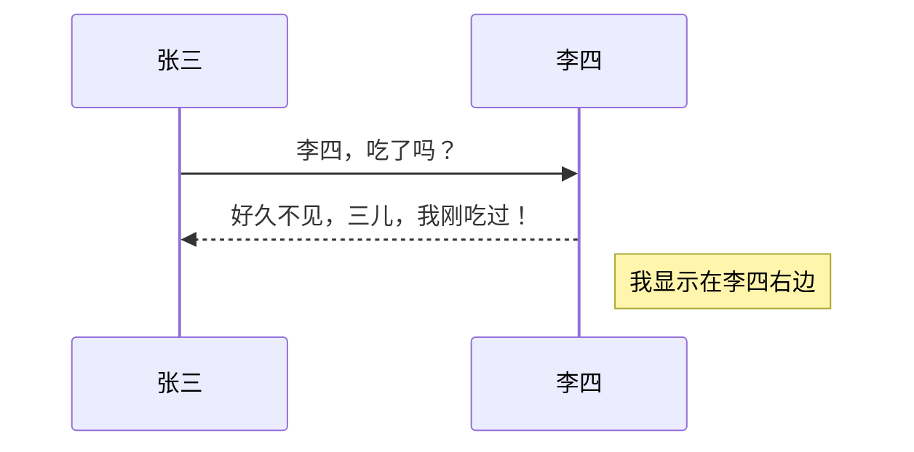
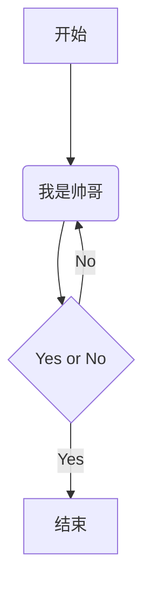
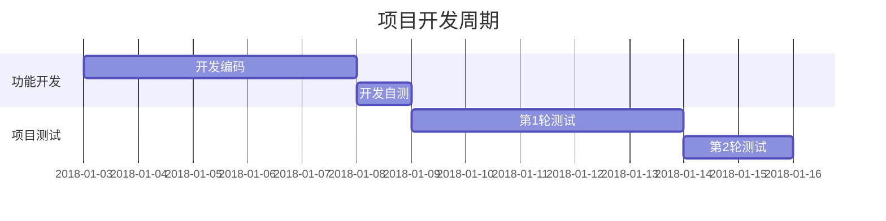

# 1.3  拓展语法

****

## ==3.1== 编辑样式

### a. 下划线

<u>下划线</u>

格式：`<u>内容</u>`


### b. 内联数学公式

$f(x,y) = \sqrt[n]{x^2}{y^3}$

格式：`$数学公式$`


### c. 下标和上标

​			H~2~O					X^2^+Y^2^

格式：`~下标~`			格式：`^上标^`


### d. 注释

<!--注释-->

作用：编辑跟预览的时候可以看见，导出为 PDF 或 Word 时，会被隐藏。

****

## ==3.2== 编辑段落

### a. 数学公式块
$$
\mathbf{V}_1 \times \mathbf{V}_2 = \begin{vmatrix}
\mathbf{i} & \mathbf{j} & \mathbf{k} \\
\frac{\partial X}{\partial U} & \frac{\partial Y}{\partial U} & 0 \\
\frac{\partial X}{\partial v} & \frac{\partial Y}{\partial v} & 0 \\
\end{vmatrix}
$$


格式：

```
$$
数学公式
$$
```


### b. 目录

格式：`[TOC]`   

> TOC是Table of contents的缩写。


### c. 脚注

我的手机[^1]

[^1]:MIX 

格式：`[^1]`   `[^1]:脚注的描述`


### d. 图表

> Typora的拓展语法，MD并不支持

* ==序列图==

```sequence
张三->李四: Says Hello
Note right of 李四: China thinks\nabout it
李四-->张三: How are you?
张三->>李四: I am good thanks!
```

格式：3个`+sequence

​		[语法参考链接](https://bramp.github.io/js-sequence-diagrams/)

* ==流程图==

```flow
st=>start: 开始
op=>operation: 我是帅哥
cond=>condition: Yes or No?
e=>end: 结束

st->op->cond
cond(yes)->e
cond(no)->op
```

格式：3个`+flow

​		[语法参考链接](http://flowchart.is.org)

* ==Mermaid==

> 可用文本生成图表，包括序列图、流程图和甘特图
>
> 序列图



> 流程图



> 甘特图




格式：3个`+mermaid          ( ==%%== 后是注释，跟代码中的 ==//== 是同效)

​		[序列图语法](http://knsv.github.io/mermaid/#loops32)

​		[流程图语法](http://knsv.github.io/mermaid/#grah18)

​		[甘特图语法](http://knsv.github.io/mermaid/index.html#mermaid-cil)

****

[^1]:
